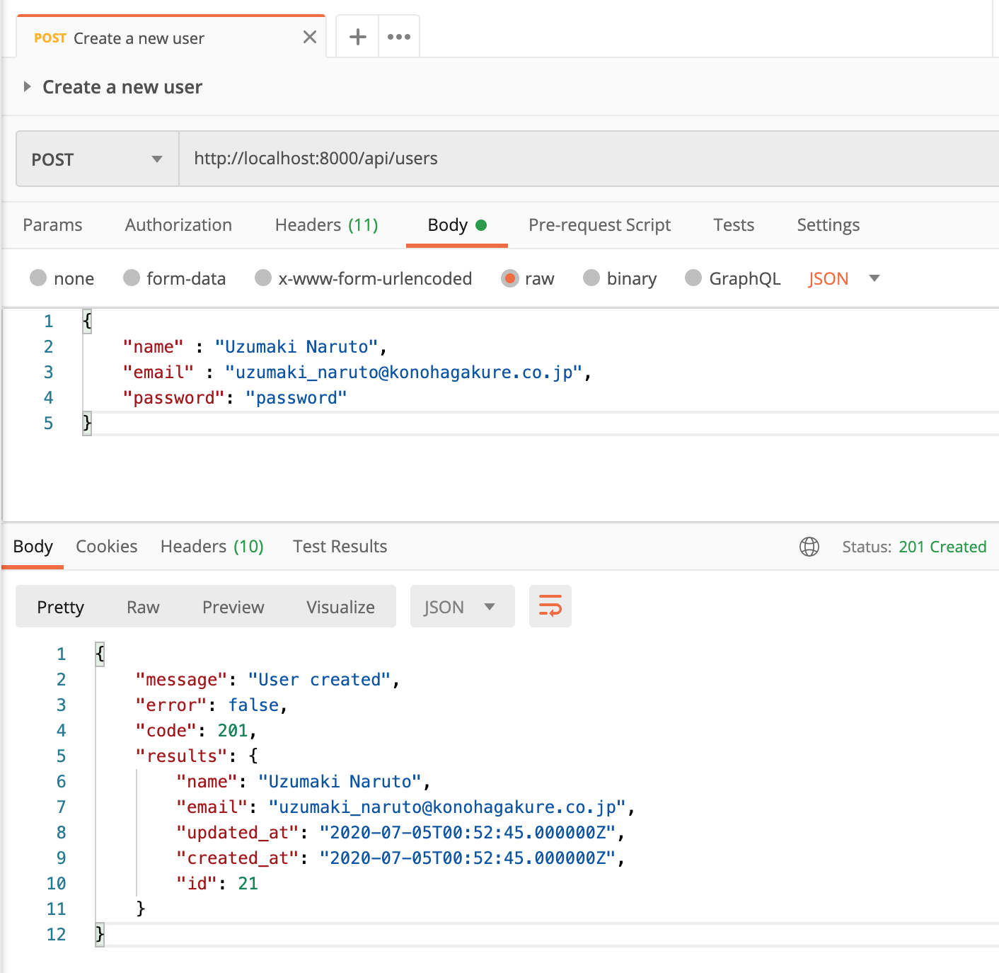
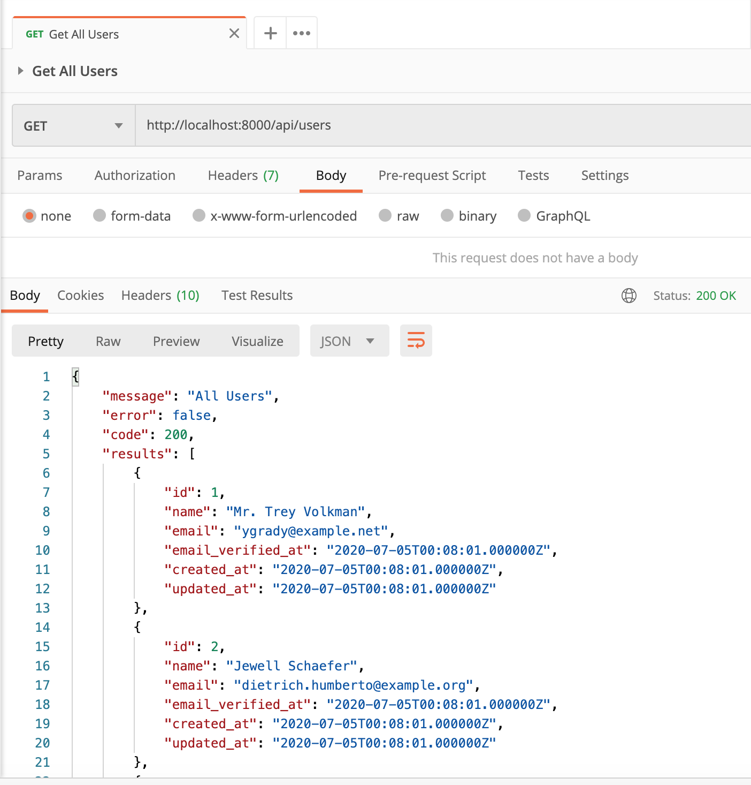
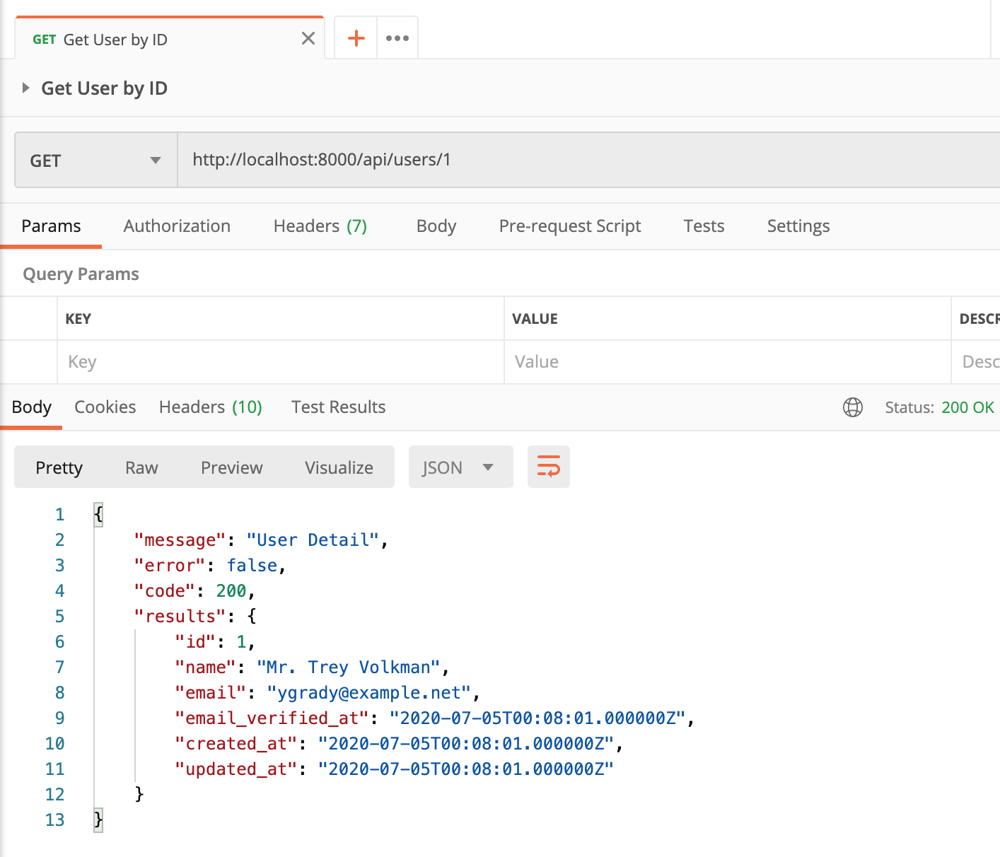
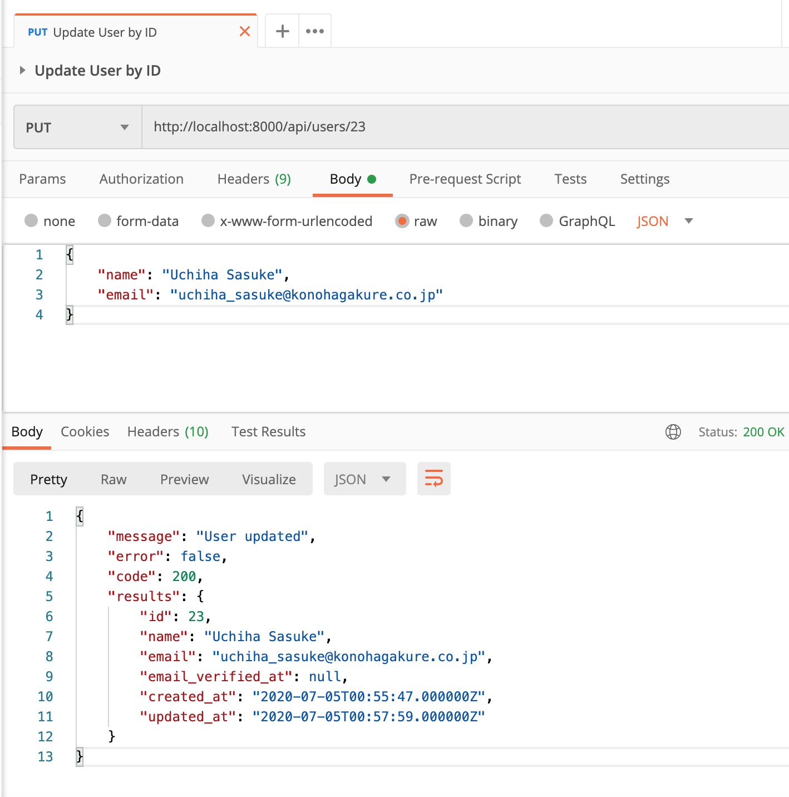
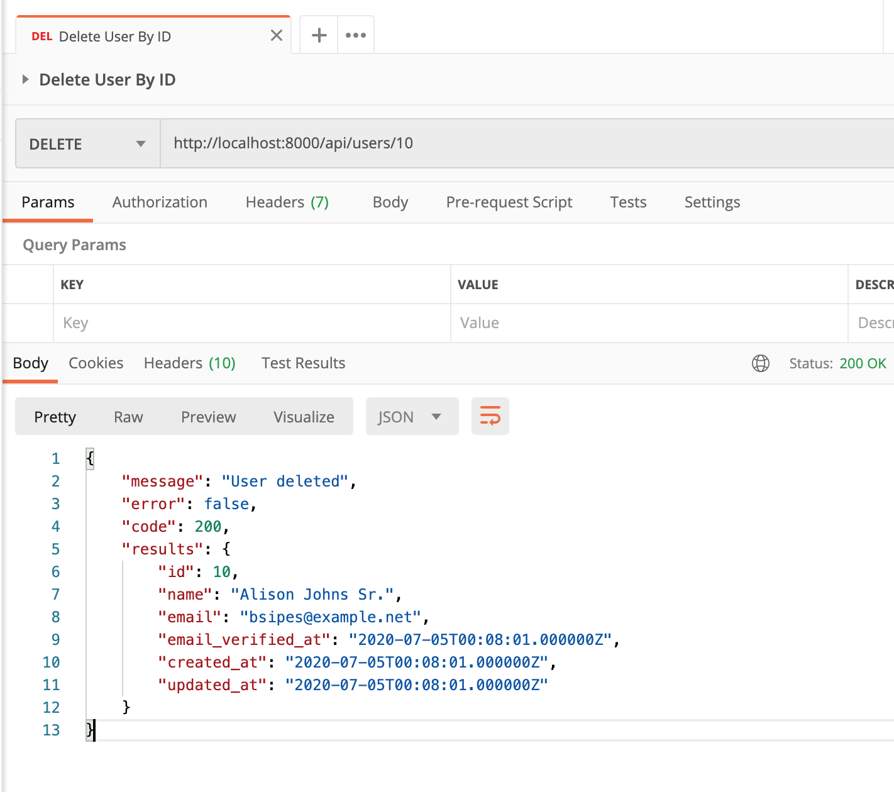
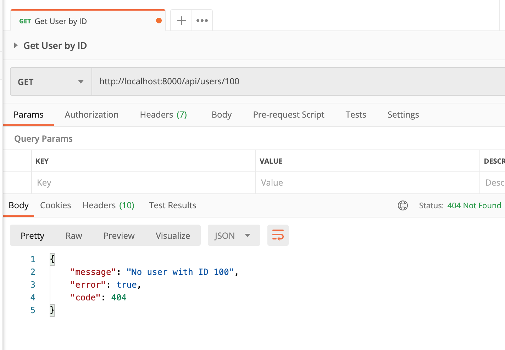

## Laravel with Repository Pattern
Structured Laravel application using Repository Pattern V1.0.0

## About Laravel

Laravel is a web application framework with expressive, elegant syntax. We believe development must be an enjoyable and creative experience to be truly fulfilling. Laravel takes the pain out of development by easing common tasks used in many web projects, such as:

- [Simple, fast routing engine](https://laravel.com/docs/routing).
- [Powerful dependency injection container](https://laravel.com/docs/container).
- Multiple back-ends for [session](https://laravel.com/docs/session) and [cache](https://laravel.com/docs/cache) storage.
- Expressive, intuitive [database ORM](https://laravel.com/docs/eloquent).
- Database agnostic [schema migrations](https://laravel.com/docs/migrations).
- [Robust background job processing](https://laravel.com/docs/queues).
- [Real-time event broadcasting](https://laravel.com/docs/broadcasting).

Laravel is accessible, powerful, and provides tools required for large, robust applications.

### Things todo list:
1. Clone this repository: `git clone https://gitlab.com/laravel-web-application/laravel-api-repository-pattern.git`
2. Go inside the folder: `cd laravel-api-repository-pattern`
3. Run `cp .env.example .env` then put your DB name & credentials
4. Run `composer install`
5. Run `php artisan key:generate`
6. Run `php artisan migrate`
7. Run `php artisan serve`
8. Open your favorite REST API Client such as [POSTMAN](https://www.postman.com/downloads/) or [Insomnia](https://insomnia.rest/download/)
9. Import POSTMAN Collection into your POSTMAN App.

### Screen shot

Add New User

List All Users

Find User By ID

Update User By ID

Delete User By ID

Error Message

